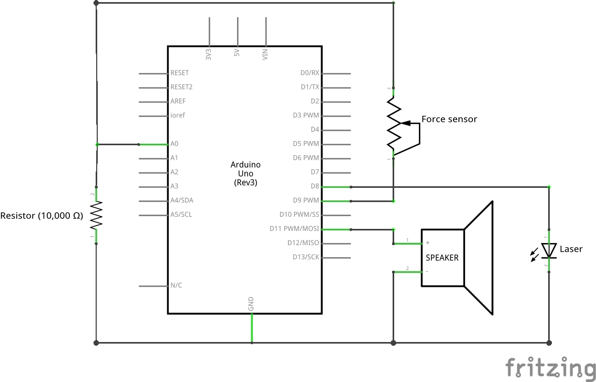

# Laser Nerf Gun

Arduino sketch which adds a laser and sound effects to a Nerf gun.

Created by Charles Li and Jeffrey Leung.

## Final Product
[Demo video](https://www.youtube.com/watch?v=3ZZukPEmepA)

## Setup

### Libraries Used
* [PCM (Pulse-code modulation)](https://github.com/damellis/PCM)

### Setting up the Code
* [Instructions for installing and using PCM](http://highlowtech.org/?p=1963)
* Simplified instructions for installing PCM:
  * Open the Arduino program
  * Navigate to _File_, _Preferences_
  * Note the location of the Arduino sketchbook folder
  * Move the _libraries_ folder in this repository into the aforementioned sketchbook folder
* Open *laser\_nerf\_gun/laser\_nerf\_gun.ino* in the Arduino program

### Circuit Components Used
[Arduino Uno (SparkFun Redboard)](https://www.sparkfun.com/products/12757)

[Interlink Force Sensing Resistor - 0.2" Circular](https://www.pololu.com/product/1695)  
SKU: SFE-09673

[Seeed Studio Laser Emitter Module](https://www.rpelectronics.com/se-irl104a2b.html)  
SKU: SE-IRL104A2B

[USB Speaker JY-2030 (Speaker extracted)](http://www.made-in-china.com/showroom/electronic99/product-detailSMqnKURVArhF/China-Speaker-JY-2030-.html)

### Setting up the Circuit

* The speaker is, by default in the PCM library, set to output on pin 11

Verify and upload the code to the Arduino and you're done!
